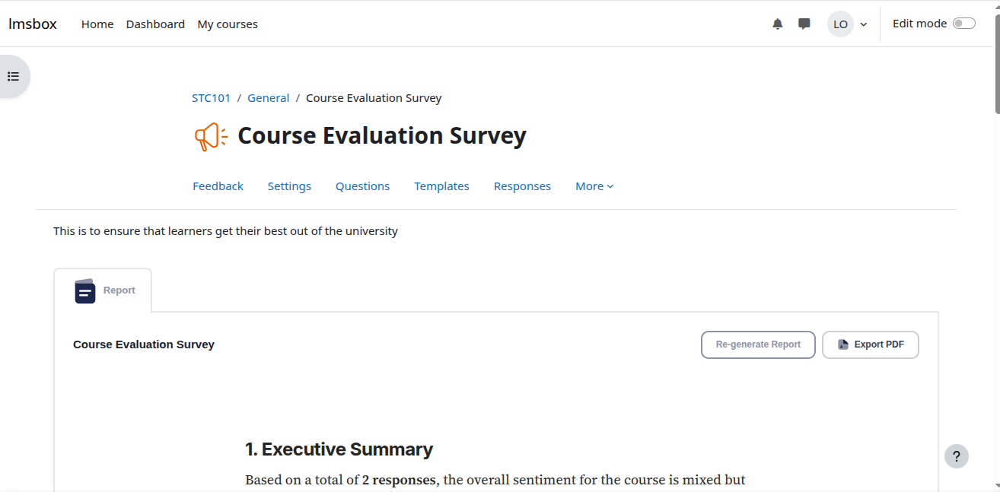
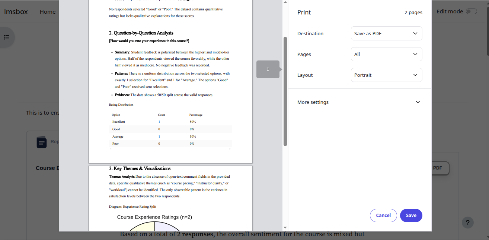
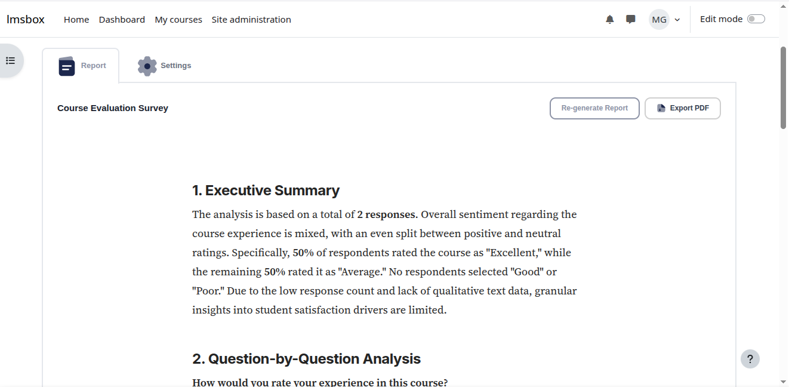
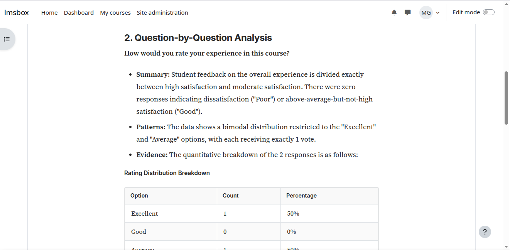
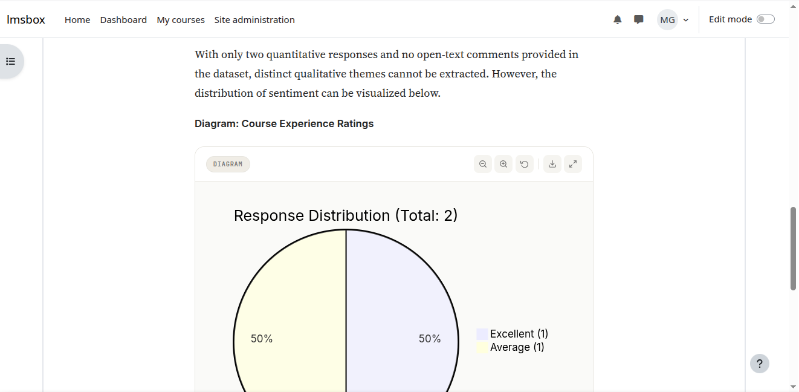
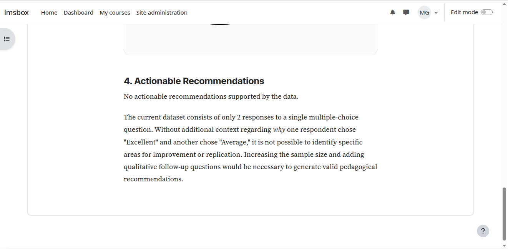

# Feedback Explorer — Moodle Local Plugin

An AI-powered feedback analysis plugin for Moodle that generates structured
markdown reports from course feedback activity data.

## Author

**Grace Peter Mutiibwa**

## Screenshots

**Lecturer view — clean interface, no settings exposed**

**Admin view — auto-loaded report with Re-generate and Export PDF**

**Executive summary and question-by-question analysis**

**Question analysis with clean tables**

**Mermaid pie chart rendering**

**Actionable recommendations section**

## Requirements

- Moodle 4.0+
- An OpenAI-compatible LLM API (e.g. OpenRouter, OpenAI)

## Installation

1. Clone or unzip into `/local/feedbackexplorer`
2. Visit Site Administration → Notifications to complete install
3. Configure LLM settings as admin via the plugin's Settings tab

## License

GNU GPL v3 or later
